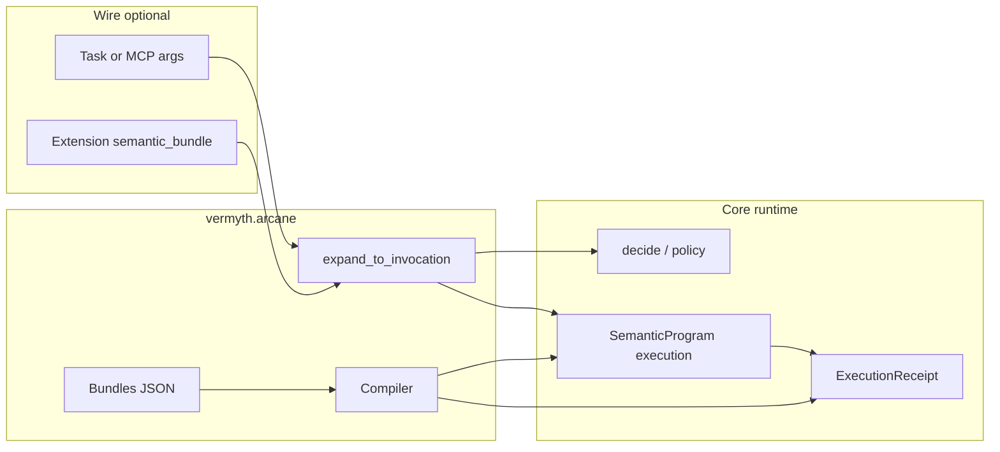

# Arcane semantic layer — design summary

This document is a **high-level digest** of the arcane ontology as a coordination layer on the existing Vermyth runtime. For vocabulary and operational rules, see [ontology.md](ontology.md).

## Purpose

The arcane layer gives **named, reusable semantic bundles** (rituals, wards, divination gates, banishment rules) a **first-class path** through compilation, policy, and provenance—without replacing the baseline contract of **`skill_id` + `input`**. Clients may send plain JSON forever; bundles are **opt-in** and expand **server-side**.

## Architecture

- **Compiler** merges wards into thresholds, applies banishment constraints on programs, compiles rituals to `SemanticProgram` with `metadata["arcane"]`.
- **Invoke** turns `semantic_bundle` (or equivalent) into expanded `skill_id`, `input`, and **`arcane_provenance`** for inspection and receipts.

## Concept → behavior (short map)

| Concept | Runtime effect |
|--------|-----------------|
| **Ritual** | `RitualSpec` → `SemanticProgram` + arcane metadata; same execution path as other programs. |
| **Ward** | `PolicyThresholds` merge on `decide` / expansion. |
| **Divination** | `__require_causal_root__` and/or tighter thresholds when the bundle says so. |
| **Banishment** | Rollback / stricter handling for destructive nodes when strict. |
| **EffectClass (narrative)** | Presentation and docs only; does not alter resonance math by itself. |

## Key modules and artifacts

| Area | Location |
|------|----------|
| Types, bundle manifest, compiled invocation | [`vermyth/arcane/types.py`](../../vermyth/arcane/types.py) |
| Ward merge, ritual/bundle compile | [`vermyth/arcane/compiler.py`](../../vermyth/arcane/compiler.py) |
| Built-in + optional `VERMYTH_ARCANE_BUNDLE_DIR` | [`vermyth/arcane/bundles.py`](../../vermyth/arcane/bundles.py), [`vermyth/data/arcane/bundles/`](../../vermyth/data/arcane/bundles/) |
| Expansion / strip helpers | [`vermyth/arcane/invoke.py`](../../vermyth/arcane/invoke.py) |
| Extension URI constant | [`vermyth/arcane/constants.py`](../../vermyth/arcane/constants.py), re-exported from [`vermyth/adapters/a2a/extensions.py`](../../vermyth/adapters/a2a/extensions.py) |
| HTTP/A2A gateway + executor | [`vermyth/adapters/a2a/gateway.py`](../../vermyth/adapters/a2a/gateway.py), [`vermyth/adapters/a2a/vermyth_executor.py`](../../vermyth/adapters/a2a/vermyth_executor.py) |
| Receipt field + persistence | [`vermyth/schema/_legacy.py`](../../vermyth/schema/_legacy.py) (`arcane_provenance`), [`vermyth/grimoire/repositories/receipts.py`](../../vermyth/grimoire/repositories/receipts.py) |
| MCP tools | [`vermyth/mcp/tools/arcane.py`](../../vermyth/mcp/tools/arcane.py) (`expand_semantic_bundle`, `compile_ritual`) |

## Discovery (list, inspect, preview)

- **MCP tools:** [`list_semantic_bundles`](../../vermyth/mcp/tools/arcane.py) (optional `kind` filter), [`inspect_semantic_bundle`](../../vermyth/mcp/tools/arcane.py) (`bundle_id`, `version`, optional `params` for an exact compiled preview).
- **MCP resources:** `vermyth://semantic_bundles` (optional `?kind=`), `vermyth://semantic_bundle/{bundle_id}?version=1` — same JSON as the tools (read-only).
- **HTTP:** [`GET /arcane/bundles`](../http_adapter.md) and [`GET /arcane/bundles/{bundle_id}`](../http_adapter.md) — see [`docs/http_adapter.md`](../http_adapter.md).
- Built-in bundle JSON lives under [`vermyth/data/arcane/bundles/`](../../vermyth/data/arcane/bundles/) with optional `summary`, `description`, `recommended_for`, `stability`. Inspect responses include **manifest** + **compiled_preview** so the runtime form is never hidden.

## Bundles to prefer first (canonical workflows)

| Bundle | Target | Why bundle-first |
|--------|--------|------------------|
| `coherent_probe` | `decide` | One `semantic_bundle` ref vs full `intent` + `aspects`; provenance on the result. |
| `strict_ward_probe` | `decide` | Encodes ward thresholds (0.92 / effect-risk) without hand-writing `thresholds`. |
| `divination_gate` | `decide` | Encodes causal/divination gate; fails without `causal_root_cast_id` when required. |

Plain JSON equivalents are documented in [`docs/http_adapter.md`](../http_adapter.md); both remain supported.

## Wire protocol

- **Baseline:** Any task or tool call may use only **`skill_id`** and **`input`** (plain JSON).
- **Optional:** **`vermyth.io/v1/semantic_bundle`** (A2A extension) or inline **`semantic_bundle`** on tool arguments; server expands to the baseline plus provenance. See [`docs/a2a-compatibility.md`](../a2a-compatibility.md).
- **Parity:** `POST /a2a/tasks`, MCP **`tools/call`**, MCP binary **PACKET** tool dispatch (non-session handlers), and **`POST /tools/<name>`** all use [`resolve_tool_invocation`](../../vermyth/arcane/invoke.py) so bundle expansion matches the task gateway. Meta-tools `expand_semantic_bundle`, `compile_ritual`, `list_semantic_bundles`, and `inspect_semantic_bundle` are exempt from pre-expansion.
- **MCP:** Stable tools listed in [`docs/STABILITY.md`](../STABILITY.md). See [`docs/http_adapter.md`](../http_adapter.md) for bundle-first HTTP examples.

## Persistence

- Execution receipts may store **`arcane_provenance`** when the run used arcane compilation or expansion (see grimoire migrations, e.g. `v021_execution_receipt_arcane.sql`).

## Receipt signing

Canonical receipt JSON (used for Ed25519 signing) includes all model fields except `signature` and `signing_key_id`. If `arcane_provenance` is present, it is part of the signed payload—see [`vermyth/receipt_signing.py`](../../vermyth/receipt_signing.py).

## Engine vs interoperability: what is essential?

| Layer | Essential? | Notes |
|-------|------------|--------|
| **Engine** (resonance, policy, programs, grimoire) | **Yes** | Core behavior and storage. |
| **Arcane ontology** (bundles, compiler, provenance) | **No** | Optional layer; omitting bundles does not remove core casting or programs. |
| **Wire** (plain task JSON, MCP) | **Baseline contract** | Bundles and A2A extensions are **optional**; clients that ignore extensions still interoperate at the skill/input level. |

In short: the ontology is **essential for narrative consistency and reusable coordination** when you adopt it; it is **not** required for a minimal Vermyth deployment or for clients that only send `skill_id` + `input`.

## Related docs

- [ontology.md](ontology.md) — operational ontology
- [README.md](../../README.md) — product overview and arcane subsection
- [STABILITY.md](../STABILITY.md) — stable surfaces
- [security-threat-model.md](../security-threat-model.md) — trust boundaries for HTTP/A2A
